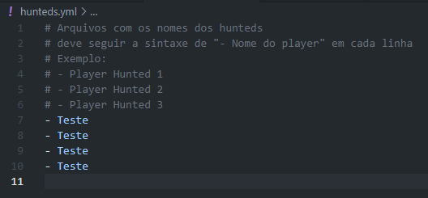
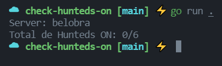

# ⚡️ Check Hunteds ON ⚡️


Este projeto foi criado para praticar a linguagem Go.

Possivelmente vire um projeto de verdade com outras feats e GUI.

## Requerimentos
```bash
go get -u gopkg.in/yaml.v2
```

Para usar basta colocar os nomes dos players hunteds no arquivo hunteds.yml seguindo sua sintaxe e rodar o programa.



Ao rodar, o programa irá pedir para digitar o nome do mundo onde quer pesquisar os players, basta digitar e dar enter.



Caso não tenha o go instalado no PC tbm pode rodar os executaveis.
Windows: check-hunteds.exe
Linux: check-hunteds-linux